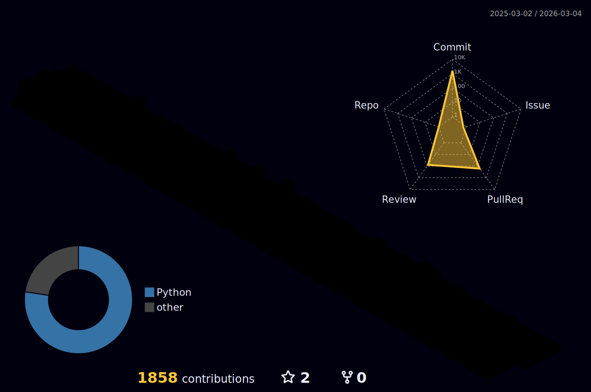

## Introduction
안녕하세요! 백엔드 개발자로 일한 경험이 있으며, 현재는 재직중입니다.
맡은바 제 임무에 책임을 다하며, 소통을 중요시하고 최대한 효율적으로 일하고 싶어합니다.

## 1️⃣ Framework & Libraries
   
  
  

## 2️⃣ Languages
  

## 3️⃣ Databases
  

## 4️⃣ OS
 

 

## Career
#### 1. 22-11 ~ Ing   영우씨엔아이 재직중
#### 2. 22-02 ~ 22-07 엠에스링크앤솔루션 근무
#### 3. 20-08 ~ 21-06 디노밴 네트웍스 근무

## 프리랜서 외주
#### 웹개발 플랫폼 풀스택 개발 중 😭

## Career Description

### 측색기 프로젝트
#### 소속회사 : 영우씨엔아이
#### 수행 기간 : 23-05 ~ Ing
#### 주요 역할 : 머신러닝을 이용한 측색값을 입력 받아 Pantone color와 비슷한 ID를 출력
#### 사용 기술 : 싸이킷런, 파이썬, 장고, 자바스크립트, 넘파이

### 결제서버 구축
#### 소속회사 : 영우씨엔아이
#### 수행 기간 : 23-02 ~ 23-03 (1개월 소모)
#### 주요 역할 : 결제서버 구축 및 결제 API 연동
#### 업무 성과 : 결제서버 신규 구축 후 안정화 및 본 홈페이지와 연동 완료
#### 사용 기술 : 토스페이먼츠 결제모듈 API , 자바스크립트 , 파이썬 , 장고

### LG ITMS 재구축
#### 소속회사 : 엠에스링크앤 솔루션
#### 수행 기간 : 22-01 ~ 22-07(6개월 소모)
#### 주요 역할 : 레거시 코드 리팩토링, 심의 요청 페이지 개발 및 제경비 페이지 재구축
#### 업무 성과 : LG ITMS 재구축 후 DB로 SELECT 문 15초 정도 소요되던것 3초정도로 감소 시킴
#### 사용 기술 : 스프링, BizActor(LG CNS 프레임워크), 자바스크립트, 제이쿼리 

### KT RINGO
#### 소속회사 : 디노밴 네트웍스
#### 수행 기간 :21-02 ~ 22.06 (4개월 소모)
#### 주요 역할 : 화면 설계 및 DB SQL 작성
#### 업무 성과 : KT RINGO 재구축 및 고도화
#### 사용 기술 : 오라클 SQL문 재정의 및 자바스크립트, 자바

## 앞으로 해나가야 할것들
#### RESTful API 를 조금 더 많이 경험 해보기
#### 이론 관련 CS 책 읽으며 배경지식 넓히기
#### 웹호스팅, 클라우드를 이용 경험 능숙하게 가져보기
#### Git 커밋할때 메시지를 깔끔하게 만들기

