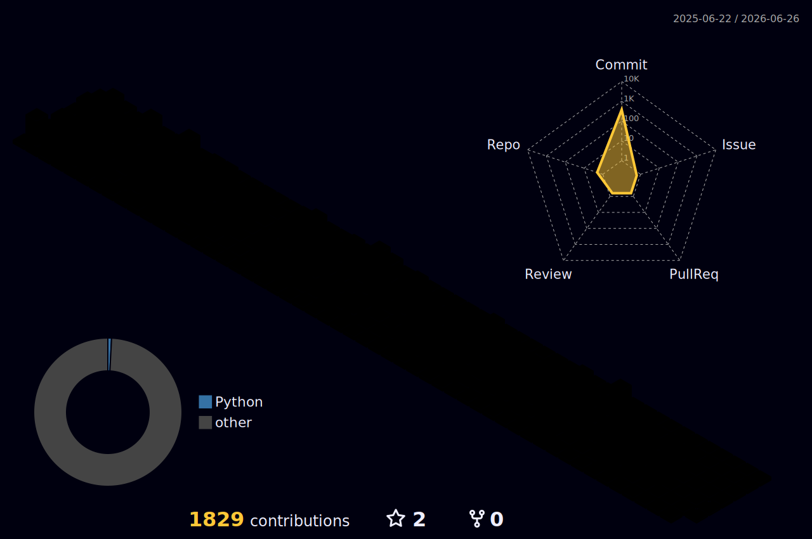

# 👋 Hi, I'm MIN CHANKI

Backend Developer focused on **Python / Django**

스타트업, 중소기업, 프리랜서 환경에서  
관리자 플랫폼, 운동 데이터 시스템, 인증 시스템, 외부 API 연동 및 운영 자동화를 개발했습니다.

### Interested In

- Backend Architecture
- Scalable Systems
- Performance Optimization
- DevOps & Automation

---

## 🚀 Experience Highlights

✔ Django + DRF 기반 API 설계 및 구현

✔ Google / Apple OAuth 인증 시스템 구축

✔ AWS SES 기반 이메일 인증 시스템 구축

✔ 결제/구독 시스템 구축 및 운영 (Steppay)

✔ 운동 데이터 처리 및 리포트 시스템 설계

✔ GitHub Actions 기반 CI/CD 구축

✔ 운영 데이터 정합성 및 레거시 개선

✔ Slack / Sentry 기반 운영 모니터링 구축

---

## 🛠 Tech Stack

### Backend

    

### Infrastructure

  

### Database / Monitoring

 
 

---

## 💼 Career

🚀 Ronfic | Backend Developer
2024.06 ~ Present

* 관리자 플랫폼(Ronbox) API 설계 및 구현
* Google / Apple OAuth 인증 시스템 구축
* AWS SES 기반 이메일 인증 시스템 구축
* 운동 리포트 Service Layer + Hook 구조 설계
* Steppay 결제 및 구독 시스템 구축
* Careweavr / Daewoong 외부 API 연동
* 운동 데이터 결과지 다국어(i18n) 시스템 구축
* GitHub Actions 기반 CI/CD 및 운영 자동화
* 운영 데이터 정합성 개선 및 Backfill 작업 수행

---

💳 Youngwoo CNI | Backend Developer
2022.11 ~ 2024.05

* Django 기반 결제 서버 구축 (ActiveX 대체)
* PHP 서비스와 결제 시스템 연동
* 머신러닝 기반 색상 분석 플랫폼 개발 참여
* GitHub Actions 기반 자동화 구축
* pre-commit / 테스트 문화 도입
* 개발 환경 개선 및 운영 안정화

---

🛠 Freelance Backend Developer
2023.05 ~ 2023.09

* 부동산 플랫폼 DB 설계 및 백엔드 API 개발
* Docker / Celery / Nginx 기반 배포 환경 구축
* 배포 자동화 및 운영 환경 구성
* 설계 → 개발 → 배포 전 과정 단독 수행 (기여도 80%)

---

🔧 MS Link & Solution | Backend Developer
2022.02 ~ 2022.07

* LG CNS ITMS 재구축 프로젝트 참여
* 레거시 코드 리팩토링
* 심의요청 및 신규 페이지 개발

---

🌐 Dinovan Networks | Backend Developer
2020.08 ~ 2021.06

* 네트워크 장비 통신 로직 유지보수
* 웹 통계 페이지 개발
---

## 📊 GitHub Stats

  

  

---

## 📌 Current Focus

- Clean Architecture
- Maintainable Backend Systems
- CI/CD & Automation
- Pythonic Development

