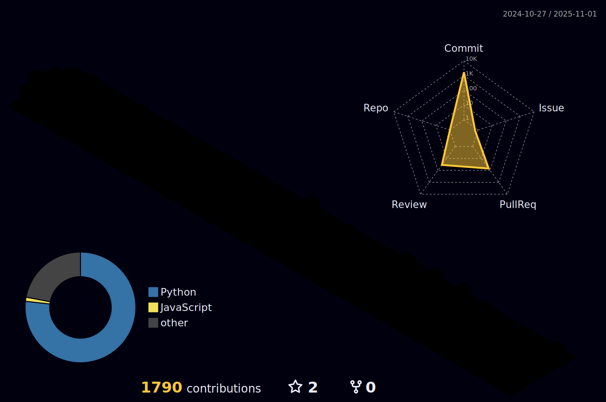

## Introduction
안녕하세요! 
맡은바 제 임무에 책임을 다하며, 소통을 중요시하고 함께 성장하기에 관심이 많은 2년차 주니어 개발자 민찬기 입니다.
Java/Spring 기반의 백엔드 지식을 주로 학습하였고, 현업에서는 Python/Django 주로 사용하고 있으며 새로운 것을 배우고 도전하는 것을 좋아합니다.

실용 음악을 전공했었지만, 군대에 입대하면서 미래를 객관적으로 보고 생각해본 결과 생활 유지가 불가능 할 것 같아 진로를 개발자로 바꿨습니다.

그리하여 마음을 먹은 김에 부산에 있는 대학을 입학하여, 열심히 공부하고 4.11이라는 학점을 받는 쾌거를 이루고 취직 준비에 만전을 기하려 국비 교육을 듣는 와중 취업을 성공하였습니다.

앞으로도 많은 새로운 경험을 하고 도전을 하며 노련하고 재치있으며 팀원들과 협업하는 유능한 개발자가 되려합니다.
## 포트폴리오

https://mck0819.notion.site/59fc5ebc39414ac2908b21bd34da98dc?pvs=4

## Skils

## 1️⃣ 프레임워크 및 라이브러리
   

## 2️⃣ Languages
 

## 3️⃣ Databases
  

## Career (총 2년 9개월)
1. 24-06 ~ ing 론픽 수습 재직중
2. 22-11 ~ 24-05   영우씨엔아이 근무
3. 22-02 ~ 22-07 엠에스링크앤솔루션 근무 
4. 20-08 ~ 21-06 디노밴 네트웍스 근무 

## Career Description

### 론픽 2024.06 - ing

python django drf 백엔드 개발자로 현재는 수습

### 영우씨엔아이   2022.11 - 24.05

python 기반 django 프레임워크로 webtex3D 유지 보수

기존 서비스에 결제 모듈 서버 도입

- 웹브라우저들이 Active X 사용 중단하여 기존 홈페이지에 있던 결제 모듈을 수정해야 되었기 때문에 새로운 결제 모듈을 만듬
- 새로 맥os 환경에서 django framework를 써서 결제 서버를 만들고, php 기반인 홈페이지와 연동하여 결제가 되면 기존 서버에게 결제 결과를 전송하는 로직을 만듬

중소기업벤처부 과제 수행

- 3D 모델의 옷감을 매핑하여 원하는 옷감으로 변경 및 정보들을 볼수있는 사이트를 구축

측색기 웹사이트 구축

- 염료 공장의 프로세스 과정이 복잡하여 염료의 배합비를 머신러닝으로 배합비를 학습시키면 프로세스가 간단해짐과 유지비가 줄어듬으로 효율을 극대화를 기대하여 개발을 착수
- 하지만, 염료 공장들의 데이터를 입수하기 어려움이 커서 임의로 RGB, CMYK 색을 측정하는 기기로 PANTONE Color의 색을 짚어주는 것으로 변경되었음.
- 모델은 회귀, 다중회귀, 군집화, 앙상블, 다각도로 사용함

홈페이지 유지 보수

- SSL 인증 연장 및 도메인 연장
- 도메인 연결
- php 언어 환경에서 유지 보수 중

개발 환경 문화 만들기

- Git Action을 이용하여 Test 자동화 하기
- pre-commit을 이용하여 유지 보수 증대 ( pre-commit-hooks, black, isort, flake8 )
- 사내 위키를 만들어 다른 부서들과 원할한 소통을 기대하여 도입 시도

팀 내 테스트 코드 도입

- 팀 내 테스트 코드가 전무한 상황에서 테스트 코드 도입을 위한 테스트 코드 중요성 각인 및 도입 시도

팀 내 개발 안정화를 위한 테스트 서버 도입

- 운영 서버와 동일한 환경의 테스트 서버를 도입하여, 운영 서버 배포 전 테스트를 통한 개발 안정성 상승 시도
- 비용 문제로 시도에 그쳤음

### 프리랜서 외주 2023.05 ~ 23.09
- 부동산 플랫폼에서 각종 전문가들과 협업을 돕기 위한 웹페이지 제작
- 총 5명이 함께 진행 (클라이언트, 기획자, 퍼블리셔 2분, 백엔드)
- DB 설계 및 구축, 회원가입 페이지 및 협업요청 페이지, 커뮤니티 페이지, 전문가 찾기 페이지, admin 페이지 구축
- 카카오톡 Api 알림톡 및 SNS 문자인증 연동 , 마감기한 celery beat로 스케쥴러 활용
- 팀 내에 프론트엔드를 담당할 사람이 없어 서버사이드 렌더링 방식으로 개발 착수 (기여도 80%)
- 가비아 클라우드에서 Docker로 각각의 image들을 만들고, Docker-compose로 통합하여 서버에 배포하는 식으로 구축하였음
- 주요 역할 : 웹개발 플랫폼 풀스택 개발
- 구축 환경 :  Python3.9 ++ , Django Framework, Docker, Postgresql
- 운영 환경 : GabiaCloud, Celery, Nginx, Docker
 
### 엠에스링크앤솔루션 2022.2 - 2022.7

- LG CNS로 파견 LG 화학 ITMS 재구축 프로젝트 참여
- 레거시 코드 리팩토링, 심의 요청 페이지 개발 및 제경비 페이지 재구축
- 심의요청 ,제경비 페이지 재구축
- 사용 기술 : 스프링, BizActor(LG CNS 프레임워크), 자바스크립트, 제이쿼리 

### 디노밴 네트웍스  2020.8 - 2021.6

- Cent OS 환경에서 네트워크 장비 통신 로직 수정 담당
- 웹 페이지 통계 화면 설계,개발 및 유지 보수 및 DB SQL 작성
- 사용 기술 : 오라클 SQL문 재정의 및 자바스크립트, 자바

 

## 앞으로 해나가야 할것들
RESTful API 를 조금 더 많이 경험 해보기

개념 관련 CS 책 읽으며 배경지식 넓히기

웹호스팅, 클라우드를 이용 경험 능숙하게 가져보기

Git 커밋할때 메시지를 깔끔하게 만들기

TDD 프로그래밍 해보기

빌드/테스트/배포 자동화 경험해보기

오픈소스 코드 수정하고 활용해보기

